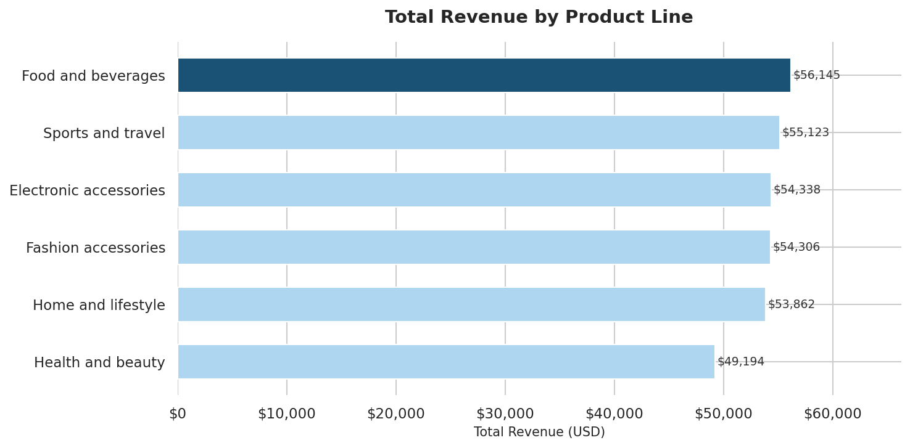
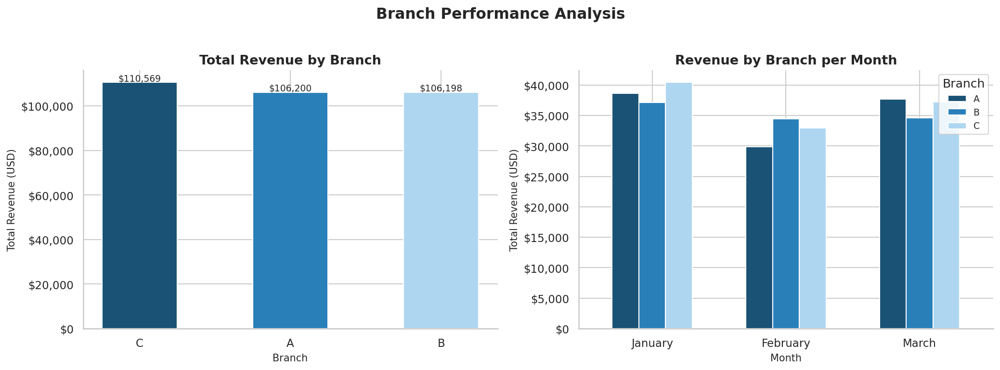
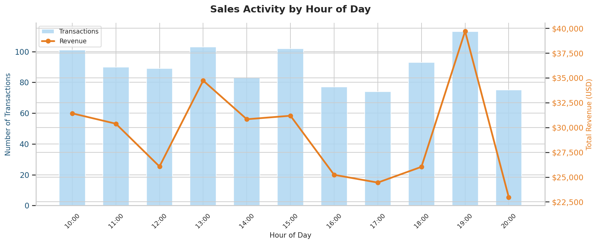
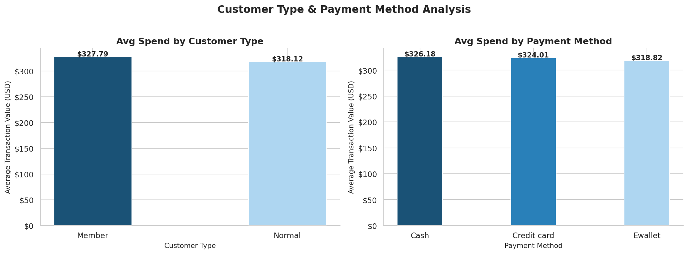

# 🛒 Supermarket Sales Analysis — Python

A data analysis project answering 4 business questions using 
1,000 supermarket transactions across 3 branches.
Built with Python as part of a Data Analyst portfolio.

---

## The Business Questions

1. Which product line generates the most revenue?
2. Which branch performs best — and does it vary by month?
3. What time of day drives the highest sales volume?
4. Which customer type and payment method spends the most?

---

## Key Findings

- **Food & Beverages** leads revenue; **Health & Beauty** 
  ranks lowest despite being a high-margin category
- **Branch C** leads overall but no branch dominates 
  every month — performance shifts across January–March
- **19:00 (7pm)** is the peak transaction hour but revenue 
  peaks at a different hour — the busiest time ≠ most 
  valuable time
- **Members** outspend Normal customers per transaction; 
  **Cash** is the highest average-spend payment method

---

## Charts

### Revenue by Product Line

### Branch Performance by Month

### Sales Activity by Hour

### Customer & Payment Analysis

---

## Tools Used

| Tool | Purpose |
|------|---------|
| Python 3 | Core programming language |
| Pandas | Data loading, cleaning, grouping |
| Matplotlib | Chart building and formatting |
| Seaborn | Visual styling |
| Jupyter Notebook | Development environment |

---

## Dataset

- **Source:** [Kaggle — Supermarket Sales](https://www.kaggle.com/datasets/aungpyaeap/supermarket-sales)
- **Records:** 1,000 transactions
- **Period:** January – March 2019
- **Branches:** A, B, C

---

## How to Run

1. Clone this repository
2. Open `supermarket_analysis.ipynb` in Jupyter Notebook
3. Run all cells top to bottom (Shift + Enter)
4. No CSV file needed — data loads directly from GitHub

---

**Author:** Emmanuel Uchechukwu  
**Contact:** i.agent.kachi@gmail.com
